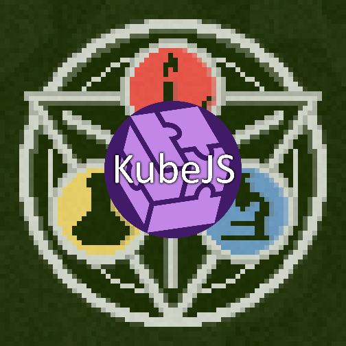

# KubeJS - Alchemsitry

*An addon for KubeJS*
• [CurseForge](https://curseforge.com/minecraft/mc-mods/kubejs-alchemistry)
• [Changelog](CHANGELOG.md)
• [Bugtracker](https://github.com/Ender-Development/kjsalchemistry/issues)

 

This mod provides KubeJS integrations for [Alchemistry](https://www.curseforge.com/minecraft/mc-mods/alchemistry).

## Builds
You can download the latest files here on [curseforge](https://curseforge.com/minecraft/mc-mods/kubejs-alchemistry).

## [Ender-Development](https://github.com/Ender-Development)

Our Team currently includes:
- `_MasterEnderman_` - Project-Manager, Developer
- `Klebestreifen` - Developer

You can contact us on our [Discord](https://discord.gg/JF7x2vG).

## Contributing
Feel free to contribute to the project. We are always happy about pull requests.
If you want to help us, you can find potential tasks in the [issue tracker](https://github.com/Ender-Development/kjsalchemistry/issues).
Of course, you can also create new issues if you find a bug or have a suggestion for a new feature.
Should you have any questions, feel free to ask us on [Discord](https://discord.gg/JF7x2vG).

## Partnership with Akliz

> It's a pleasure to be partnered with Akliz. Besides being a fantastic server provider, which makes it incredibly easy to setup a server of your choice, they help me to push myself and the quality of my projects to the next level. Furthermore you can click on the banner below to get a discount. :')

If you aren't located in the [US](https://www.akliz.net/enderman), Akliz now offers servers in:

- [Europe](https://www.akliz.net/enderman-eu)
- [Oceania](https://www.akliz.net/enderman-oce)
